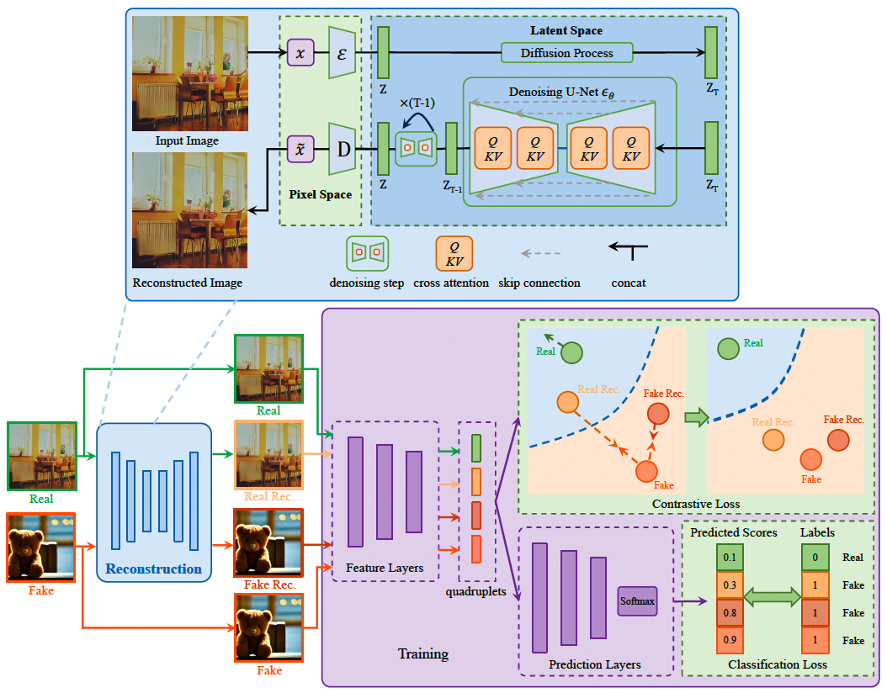

# DRCT: Diffusion Reconstruction Contrastive Training towards Universal Detection of Diffusion Generated Images
The official code of [DRCT: Diffusion Reconstruction Contrastive Training towards Universe Detection of Diffusion Generated Images](https://icml.cc/virtual/2024/poster/33086) ([pdf](https://openreview.net/pdf?id=oRLwyayrh1)), 
which was accepted by ICML2024 Spotlight.
## DRCT
The DRCT framework consists of two stages:
- Diffusion Reconstruction. An original image (either real or fake) undergoes a diffusion-then-reconstruction process, resulting in its reconstructed version that retains the original content while containing subtle diffusion artifacts.
- Contrastive Training. The detector is trained under the guidance of margin-based contrastive loss on real images, generated images, and their reconstructed counterparts (real rec. and fake rec.). In contrastive training, real images are labeled as “Real”, while the other three types of images are labeled as “Fake”.

<p align="center">The framework of our proposed DRCT.</p>

## DRCT-2M Dataset
The proposed dataset "DRCT-2M" has been released on [modelscope](https://modelscope.cn/datasets/BokingChen/DRCT-2M/files).

<p align="center">Some examples of generated images in DRCT-2M.</p>

## Diffusion Reconstruction
```
python data/diffusion_rec.py
```

## Training and Validation
### Training On ConvB
```convnext_base

```

### Training On UnivFD
```clip-ViT-L/14

```

## Testing 
```

```

## Experimental Results
### Intra-Dataset Evaluation


### Cross-Dataset Evaluation


## Acknowledgments
Our code is developed based on [CNNDetection](https://github.com/peterwang512/CNNDetection), [FreDect](https://github.com/RUB-SysSec/GANDCTAnalysis), [Gram-Net](https://github.com/liuzhengzhe/Global_Texture_Enhancement_for_Fake_Face_Detection_in_the-Wild)
, [DIRE](https://github.com/ZhendongWang6/DIRE), [UnivFD](https://github.com/Yuheng-Li/UniversalFakeDetect) . Thanks for their sharing codes and models:

## Citation
If you find this work useful for your research, please kindly cite our paper:
```
@inproceedings{chendrct,
  title={DRCT: Diffusion Reconstruction Contrastive Training towards Universal Detection of Diffusion Generated Images},
  author={Chen, Baoying and Zeng, Jishen and Yang, Jianquan and Yang, Rui},
  booktitle={Forty-first International Conference on Machine Learning}
}
```
